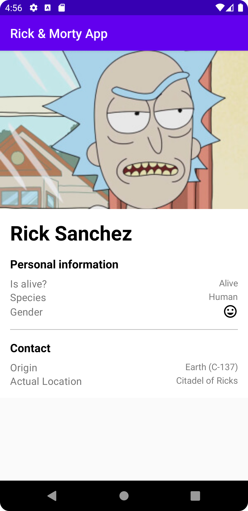

# Rick And Morty: Characters

This is a technical test for the Mango company. The requirements were to develop an app that had a paginated list screen and a detail screen. As a bonus I have used Kotlin, I have cached the images with Glide, I have caught the exceptions that may occur and shown a general message. Finally, I cached the current page with Room, implemented unit and integration tests and tried to come up with a good design.

#### Application

Now I will explain a about the app. It's done as a multi module app by following the clean architecture and using MVVM for the presentation layer. The app uses kotlin dsl for dependency management.

The apps tech stack is: LiveData, Room, ViewModels, Dagger Hilt, Constraint layout, ViewBinding, Glide, Coroutines, Jetpack Navigation and safe args, Retrofit, GSON, Material Design, Webmockserver, Mockk, Junit4, Kluent.

**LiveData**: I use it as a data container that can be observable that also respects the life cycles of the app components.

*Link*: https://developer.android.com/topic/libraries/architecture/livedata?hl=es-419

**Room**: I use it to cache the information of the app. It is an extra layer that allows me to access the SQlite database.

*Link*: https://developer.android.com/training/data-storage/room

**Dagger Hilt**: It is a dependency injection library that solves the Dagger 2 problem of repetitive work that we sometimes find. Also allows me to continue using the advantages of Dagger 2.

*Link*: https://developer.android.com/training/dependency-injection/hilt-android?hl=es-419

**Constrant layout**: I use it for creating responsive layouts.

*Link*: https://developer.android.com/training/constraint-layout?hl=es-419

**ViewBinding**: I use it to communicate the fragment class to the views of the different layouts.

*Link*: https://developer.android.com/topic/libraries/view-binding?hl=es-419

**Glide**: I use it to cache and manage images.

*Link*: https://github.com/bumptech/glide

**Coroutines**: It is used to handle background tasks, long-running tasks, not blocking the UI, etc. Kotlin native for asynchronous programming.

*Link*: https://developer.android.com/kotlin/coroutines

**Navigation component & Save args**: It is used as a new method of navigation and data passing between screens. It has the problem that it only does "replace" and does not allow "add", so sometimes the screen may react as you did not want.

*Link*:
https://developer.android.com/guide/navigation/navigation-pass-data
https://developer.android.com/guide/navigation/navigation-getting-started

**Retrofit + OkHTTP**: Library that allows us to communicate with HTTP calls through an interface.

*Link*: https://square.github.io/retrofit/

**GSON**: I use it to convert JSON objects to Kotlin objects.

*Link*: https://github.com/google/gson

**MockWebServer**: It is used to create a web server in order to test HTTP calls.

*Link*: https://github.com/square/okhttp/tree/master/mockwebserver

**Mockk**: Kotlin library that allows you to create mock data objects of your application.

*Link*: https://mockk.io/ANDROID.html

**JUnit4**: It is a framework for performing and automating tests on Java/Kotlin applications.

*Link*: https://developer.android.com/training/testing/instrumented-tests/androidx-test-libraries/rules

**Kluent**: I use it for a more “human” test readability. It also uses Kotlin's own extension functions.

*Link*: https://github.com/MarkusAmshove/Kluent

#### Arquitecture

I have based on the following image to create my interpretation of "Clean Architecture".

This is a summary of how I have structured the architecture, so that we can have something visual and quick to understand:

It has a change because I didn't find necessary to create usecases for the business logic of this app.

#### Images

Finally, here are the images of the app:

